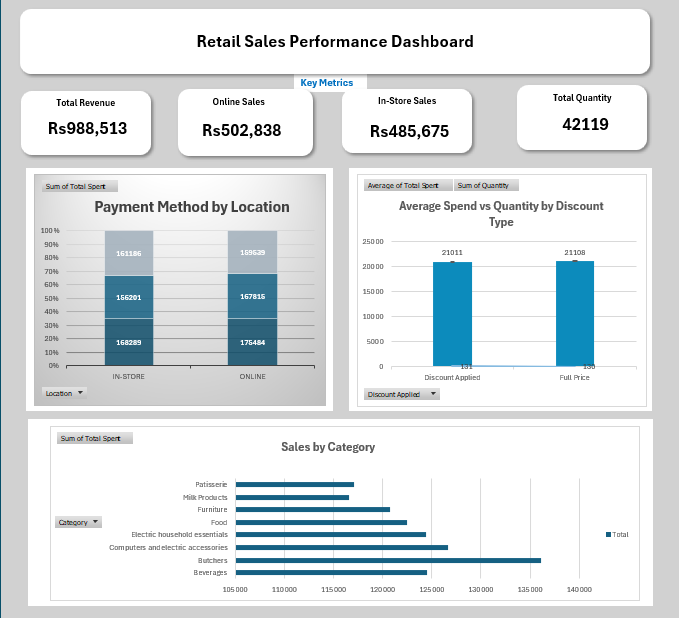

# retail-sales-dashboard
Excel dashboard analyzing retail store sales data with KPI cards, slicers, and pivot charts
# Retail Sales Performance Dashboard

An interactive Excel dashboard analyzing retail store sales data 
across multiple categories, locations, and payment methods.

## Tools Used
- Microsoft Excel (Pivot Tables, Pivot Charts, Slicers, Timeline)

## Dashboard Features
- KPI cards showing Total Revenue, Online Sales, 
  In-Store Sales, and Total Quantity
- Interactive slicers for Location and Category filtering
- Transaction Date timeline for time-based filtering
- Payment Method by Location chart
- Average Spend vs Quantity by Discount Type chart
- Sales by Category horizontal bar chart

## Key Insights
- Total revenue of Rs988,513 across 42,119 transactions
- Online sales (Rs502,838) slightly higher than 
  In-Store sales (Rs485,675)
- Beverages is the highest revenue category at Rs124,513
- Discount Applied vs Full Price shows almost identical 
  average spend (~Rs130), suggesting discounts do not 
  significantly reduce basket size

## Dashboard Preview

## Dataset
- 1000+ retail transactions
- 25 customers across 8 product categories
- Data spanning 2022 to 2025
